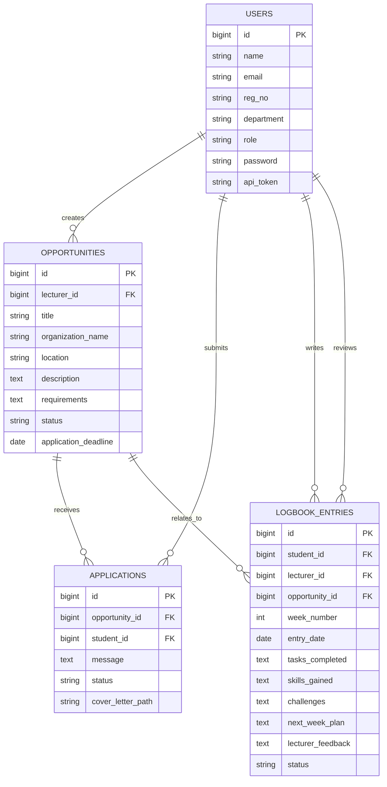

# DATS Entity Relationship Diagram

```mermaid
erDiagram
    USERS ||--o{ OPPORTUNITIES : creates
    USERS ||--o{ APPLICATIONS : submits
    OPPORTUNITIES ||--o{ APPLICATIONS : receives
    USERS ||--o{ LOGBOOK_ENTRIES : writes
    USERS ||--o{ LOGBOOK_ENTRIES : reviews
    OPPORTUNITIES ||--o{ LOGBOOK_ENTRIES : relates_to

    USERS {
        bigint id PK
        string name
        string email
        string reg_no
        string department
        string role
        string password
        string api_token
    }

    OPPORTUNITIES {
        bigint id PK
        bigint lecturer_id FK
        string title
        string organization_name
        string location
        text description
        text requirements
        string status
        date application_deadline
    }

    APPLICATIONS {
        bigint id PK
        bigint opportunity_id FK
        bigint student_id FK
        text message
        string status
        string cover_letter_path
    }

    LOGBOOK_ENTRIES {
        bigint id PK
        bigint student_id FK
        bigint lecturer_id FK
        bigint opportunity_id FK
        int week_number
        date entry_date
        text tasks_completed
        text skills_gained
        text challenges
        text next_week_plan
        text lecturer_feedback
        string status
    }
```
